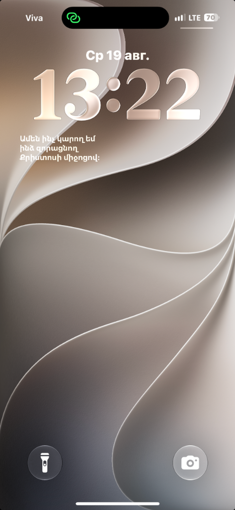

# Luys: Armenian Bible & LockScreen Widget (Լույս՝ Աստվածաշունչ և Վիդջեթ) ✝️

<p align="center">
  
</p>

Премиальное духовное мобильное приложение для iOS со встроенным интерактивным виджетом экрана блокировки (**Lock Screen Widget**), полной армянской Библией, 95 главами «Книги скорбных песнопений» Григора Нарекаци со студийной озвучкой, ИИ-помощником и библейской викториной.

---

## 🌐 Описание на трех языках / Multi-language Descriptions

### 🇦🇲 Հայերեն (Armenian)
«Luys: Armenian Bible» — ոգեշնչող, ժամանակակից և հոգևոր հավելված, որը բերում է Աստծո Խոսքը անմիջապես ձեր iPhone-ի Կողպեքրանին (Lock Screen) և Գլխավոր էկրանին (Home Screen):

* **Կողպեքրանի և Գլխավոր էկրանի Վիդջեթներ** — Աստվածաշնչի ոգեշնչող տողերը միշտ ձեր աչքի առաջ են: Յուրաքանչյուր ժամ տողի ավտոմատ թարմացում և ակնթարթային սինխրոնացում:
* **Ամբողջական Սուրբ Գիրք** — Հին և Նոր Կտակարանների բոլոր գրքերը հայերենով (Արարատ և Էջմիածնի թարգմանություններ):
* **Գրիգոր Նարեկացի՝ «Մատյան Ողբերգության» (Նարեկ)** — Բոլոր 95 Բաները (գլուխները) բնօրինակ գրաբարով, աշխարհաբարով և պրոֆեսիոնալ ստուդիական աուդիո ձայնագրություններով (Սոս Սարգսյանի և Օլեգ Մոլենկոյի ընթերցմամբ):
* **Արհեստական Բանականությամբ Հոգևոր Օգնական (AI Bible Guide)** — Խորհրդակցեք առաջատար ԱԲ մոդելների հետ (Gemini, ChatGPT, Claude)՝ աստվածաշնչյան տեքստերի մեկնաբանությունների և հոգևոր հարցերի շուրջ:
* **Աստվածաշնչյան Վիկտորինա (Bible Quiz)** — Ստուգեք և խորացրեք ձեր գիտելիքները Սուրբ Գրքի վերաբերյալ ինտերակտիվ թեստերի միջոցով:
* **Հոգևոր Բացիկների Ստեղծում** — Կիսվեք գեղեցիկ ձևավորված տողերով և աղոթքներով սոցիալական ցանցերում:

---

### 🇬🇧 English
"Luys: Armenian Bible" is an elegant, feature-rich Christian companion designed to bring the inspiring Word of God directly to your iOS Lock Screen and Home Screen.

* **Lock Screen & Home Screen Widgets** — Keep Holy Scripture close throughout your day with beautifully designed iOS widgets that refresh automatically or on demand.
* **Complete Holy Bible** — Full Old and New Testaments in Armenian (Eastern, Western, Classical / Ararat & Etchmiadzin translations), English, and Russian.
* **Saint Gregory of Narek — Book of Lamentations (Narek)** — Complete 95 chapters with high-definition studio audio recitations (by Sos Sargsyan and Oleg Molenko) and prayer texts.
* **AI Spiritual Guide** — Ask questions and explore deep biblical reflections powered by advanced AI models (Gemini, ChatGPT, Claude).
* **Bible Quiz & Trivia** — Strengthen your faith and test your biblical knowledge with engaging quizzes across multiple difficulty levels.
* **Spiritual Postcard Creator** — Share inspiring scripture verses styled with elegant gradients and typography on Instagram, WhatsApp, and Telegram.

---

### 🇷🇺 Русский
«Luys: Armenian Bible» — это современное, элегантное и духовное приложение, созданное для того, чтобы вдохновляющие строки Священного Писания всегда были перед вашими глазами на Экране блокировки (Lock Screen) и Главном экране вашего iPhone.

* **Виджеты экрана блокировки и рабочего стола** — Вдохновляющие стихи из Библии на локскрине с автоматическим обновлением и мгновенной синхронизацией.
* **Полный текст Библии** — Ветхий и Новый Завет на армянском (Эчмиадзинский и Араратский переводы), русском (Синодальный перевод) и английском языках.
* **Григор Нарекаци — «Книга скорбных песнопений» (Нарек)** — Все 95 Глав (Слов) великой молитвенной книги с профессиональной студийной озвучкой (чтение Соса Саргсяна и Олега Моленко).
* **Интеллектуальный помощник (AI Bible Guide)** — Задавайте духовные вопросы и получайте библейские толкования с помощью передовых ИИ (Gemini, ChatGPT, Claude).
* **Библейская викторина (Bible Quiz)** — Проверяйте и укрепляйте свои знания Священного Писания с помощью интерактивных тестов.
* **Генератор духовных открыток** — Создавайте красивые открытки с цитатами и делитесь ими в социальных сетях и мессенджерах.

---

## 📁 Структура проекта

```text
ArmenianBibleLockScreen.ios/
├── project.yml                          # Конфигурация XcodeGen (приложение + виджет)
├── README.md                            # Описание проекта
├── STORE_LISTING.md                     # Описания и метаданные для App Store / Google Play
├── fastlane/                            # Скрипты развертывания и метаданные App Store
│   ├── Appfile                          # Идентификаторы и Team ID
│   ├── Fastfile                         # Автоматизация TestFlight
│   ├── metadata/                        # Описания и ключевые слова (en-US, hy, ru)
│   └── screenshots/                     # Подготовленные скриншоты во всех разрешениях
├── screenshots/                         # Скриншоты для документации
│   └── 01_lockscreen_widget.png         # Первый скриншот локскрина
├── Sources/                             # Исходный код iOS приложения
│   ├── ArmenianBibleApp.swift           # Точка входа в приложение
│   ├── ContentView.swift                # Главный экран
│   ├── BibleReaderView.swift            # Читалка Библии
│   ├── NarekatsiView.swift              # 95 глав Нарекаци
│   ├── NarekAudioPlayer.swift           # Студийный плеер Нарекаци
│   ├── BibleQuizView.swift              # Библейская викторина
│   ├── BibleManager.swift               # Менеджер UserDefaults AppGroup и WidgetKit
│   └── Assets.xcassets                  # Иконки и графические ресурсы
└── Widget/                              # Код расширения виджета Lock Screen
    ├── BibleWidget.swift                # TimelineProvider и SwiftUI-виджет
    ├── BibleWidget.entitlements         # Права AppGroup для виджета
    └── Info.plist                       # Конфигурация расширения
```

---

## 🛠 Сборка и запуск

1. **Генерация проекта**:
   ```bash
   xcodegen generate
   ```

2. **Открытие в Xcode**:
   ```bash
   open ArmenianBible.xcodeproj
   ```

3. **Сборка и запуск**:
   Запустите схему `ArmenianBible` на iOS 16.0+ устройстве или симуляторе.
